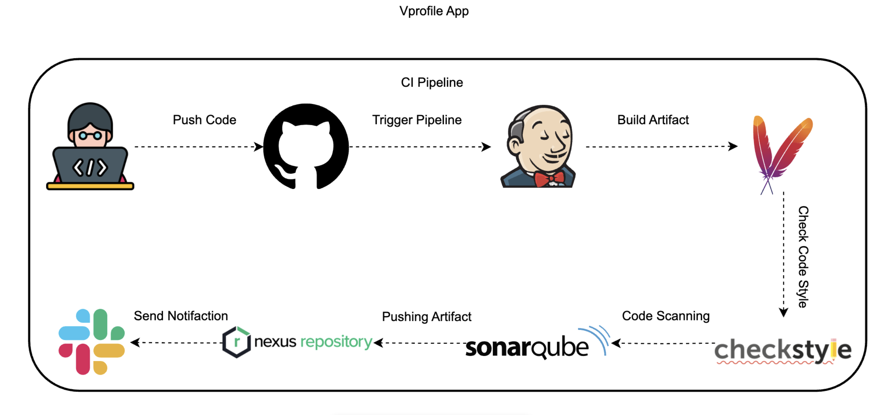

# Vprofile App: Continuous Integration (CI) Pipeline

This README outlines the Continuous Integration (CI) pipeline for the **Vprofile application**, based on the provided Jenkinsfile. The pipeline automates the process from code commit to artifact readiness and notification, ensuring code quality and build integrity.

---

## 🚀 CI Pipeline Flow Overview

The CI pipeline for the Vprofile App is designed to:

- Provide rapid feedback on code changes  
- Enforce coding standards  
- Perform comprehensive quality and security checks  
- Manage build artifacts  
- Notify developers in real-time  

The process is triggered by code pushes and ends with a validated artifact stored in Nexus, followed by a Slack notification.


---

## 📊 Visual Flow Diagram

 

---

## 🛠️ Pipeline Configuration and Stages

### Global Tools and Environment Variables

| Tool / Variable | Value / Example                |
|-----------------|--------------------------------|
| **JDK**         | JDK17                          |
| **Maven**       | MAVEN3.9                       |
| **SonarScanner**| sonarscanner                   |
| **SonarQube**   | sonarserver                    |
| **NEXUSIP**     | `54.152.99.51`                 |
| **NEXUSPORT**   | `8081`                         |
| **SNAP_REPO**   | `vprofile-snapshot`            |
| **RELEASE_REPO**| `vprofile-release`             |
| **CENTRAL_REPO**| `vprofile-maven-central`       |
| **NEXUS_GRP_REPO** | `vprofile-maven-group`      |
| **NEXUS_USER**  | `admin`                        |
| **NEXUS_PASS**  | `admin123`                     |
| **NEXUS_LOGIN** | `nexuslogin-ID` (Jenkins ID)   |

---

## 🔄 Key Stages and Components

### ✅ Build
- **Description**: Compiles the Vprofile application and packages it into a `.war` file.  
- **Command**: `mvn -s settings.xml -DskipTests install`  
- **Post-Action**: Archives the `**/*.war` artifact in Jenkins.  

### ✅ Test
- **Description**: Runs unit and integration tests.  
- **Command**: `mvn -s settings.xml test`  
- **Reports**: Generated via Surefire plugin.  

### ✅ Checkstyle Analysis
- **Description**: Enforces Java coding standards using Checkstyle.  
- **Command**: `mvn -s settings.xml checkstyle:checkstyle`  

### ✅ Sonar Analysis
- **Description**: Performs static code analysis with SonarQube.  
- **Tool**: SonarScanner  
- **Command (sample)**:  
  ```bash
  sonar-scanner \
    -Dsonar.projectKey=vprofile \
    -Dsonar.projectName=Vprofile \
    -Dsonar.sources=src/ \
    -Dsonar.java.binaries=target/ \
    -Dsonar.junit.reportsPath=target/surefire-reports/ \
    -Dsonar.jacoco.reportsPath=target/jacoco.exec \
    -Dsonar.java.checkstyle.reportPaths=target/checkstyle-result.xml
  ```  

### ✅ Quality Gate
- **Description**: Waits for SonarQube’s quality-gate status.  
- **Timeout**: 10 minutes; the build aborts if the gate fails.  

### ✅ Upload Artifact
- **Description**: Uploads the `.war` file to Nexus.  
- **Tool**: Nexus Artifact Uploader plugin  
- **Repository**: `vprofile-release`  
- **Artifact details**:  
  ```groovy
  artifactId: 'vproapp'
  file: 'target/vprofile-v2.war'
  type: 'war'
  ```

---

## 🧩 Post-Pipeline Actions

### 🟢 Slack Notification (always)
- **Channel**: `#all-devops`  
- **Message**: Build status, job name, build number, Jenkins URL.  
- **Color map**: `good` for success, `danger` for failure.  

---

## ⚙️ Technologies Used

| Purpose                | Tool                         |
|------------------------|------------------------------|
| Version Control        | Git                          |
| CI Server              | Jenkins                      |
| Build Automation       | Apache Maven                 |
| Java Runtime           | JDK 17                       |
| Code Style Analysis    | Checkstyle                   |
| Static Code Analysis   | SonarQube                    |
| Artifact Repository    | Nexus Repository Manager     |
| Notifications          | Slack                        |

---

Every change to the Vprofile codebase passes through this automated pipeline, ensuring that only tested, high-quality artifacts progress to later deployment stages.
